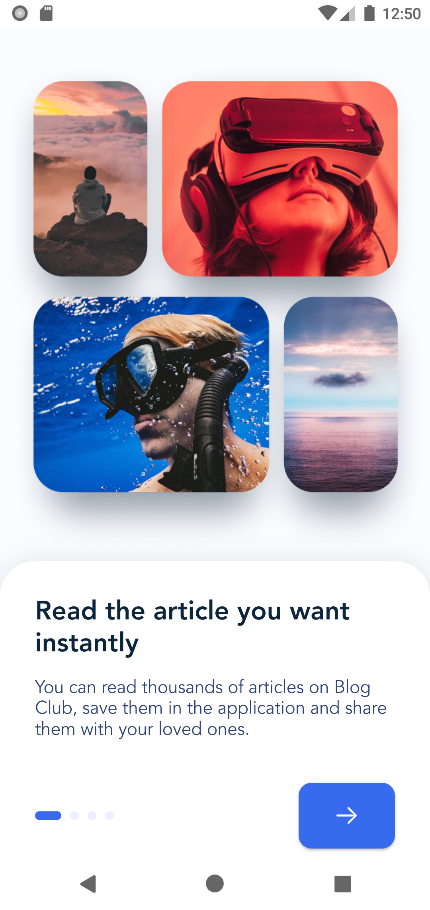
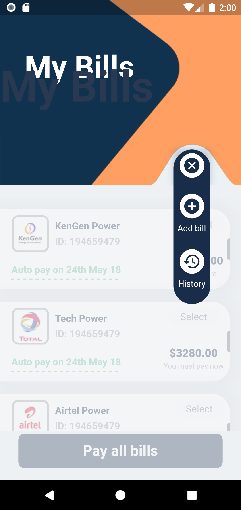
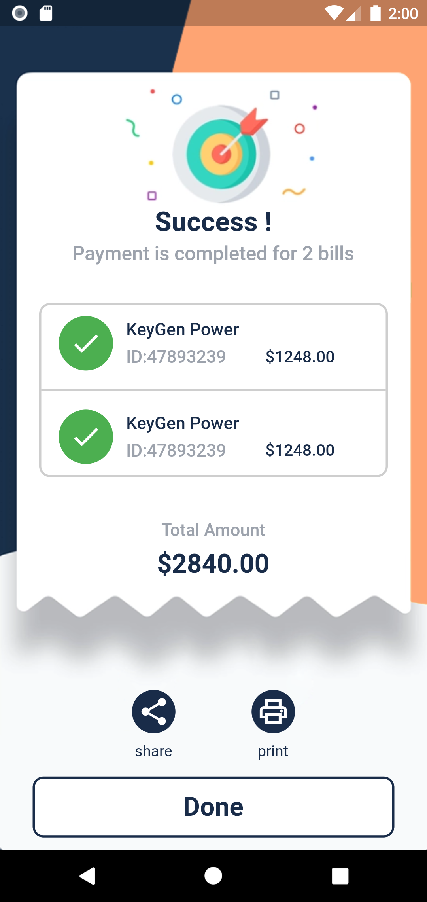

# FlutterUiSample
A collection of ui sample with Flutter.

## 01-BlogClub

  
  
  
  
  
  
  
 

   
## 02-Whatsapp Responsive

  
  
  
  
 

 
    
 
 ## 03-BookTicket

    
    
    
    
 

 
    
 
## 04-Payment

    
    
    
 

 
    
 
## 05-ClubHouse

  
  
 

 
    
 
## 06-MoneyManagement

  
 

 
    
## 07-OtpVerification

  
  
  
 

 
